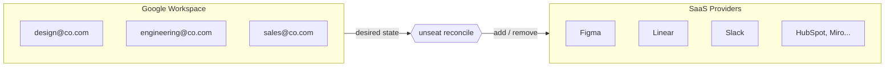
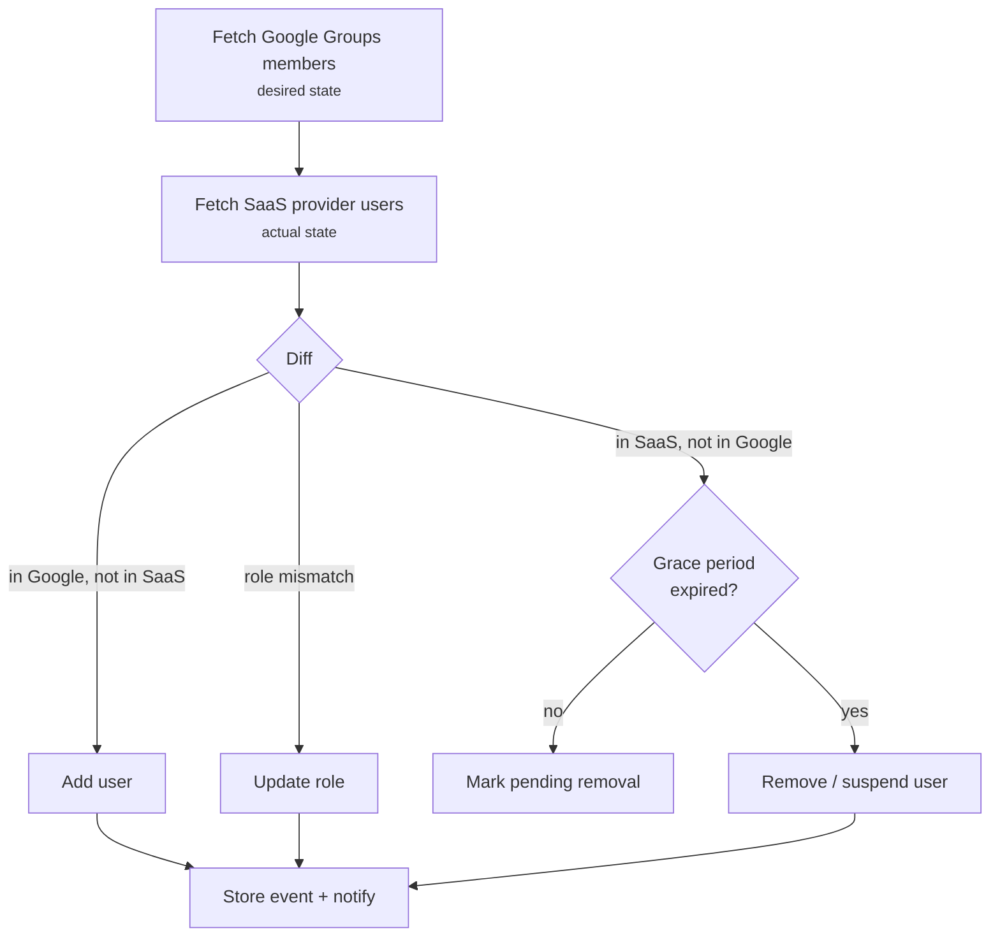
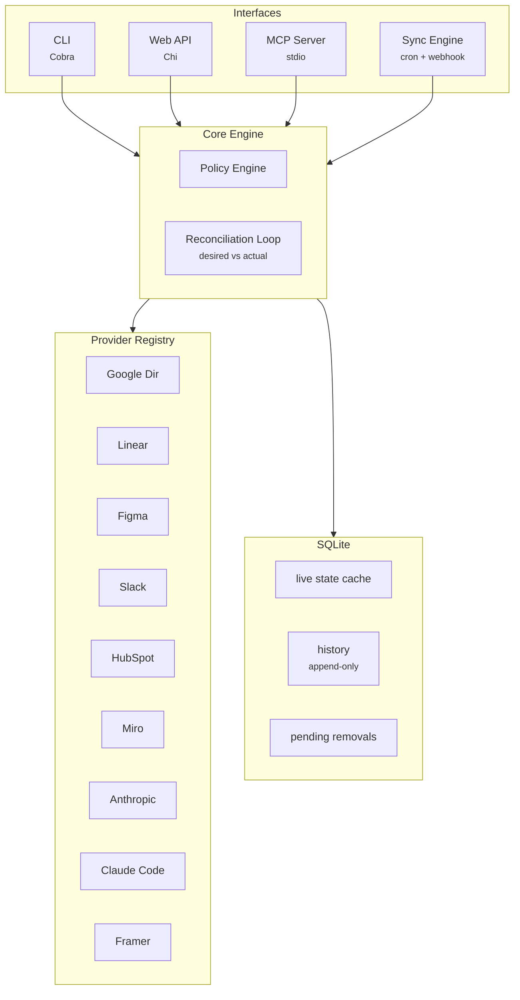

# unseat

Identity Lifecycle Management tool. Cross-references Google Workspace (source of truth) with SaaS providers to automate user provisioning, deprovisioning, and seat optimization.

## Problem

- Paying for SaaS seats of users who left the company
- Orphaned accounts across SaaS products = security surface
- Manual onboarding/offboarding across N tools
- No visibility into who has access to what

## How It Works



Kubernetes-style reconciliation: define which Google Groups map to which SaaS providers, and unseat keeps them in sync. Add someone to a group, they get provisioned. Remove them from Google Workspace, their SaaS seats get cleaned up (with configurable grace period and notifications).

## Supported Providers

| Provider | API | Auth | List Users | Remove User |
|----------|-----|------|:----------:|:-----------:|
| Google Directory | Admin SDK | OAuth2 / Service Account | yes | yes |
| Linear | GraphQL | API key | yes | yes (suspend) |
| Figma | SCIM v2 | Bearer token | yes | yes (deactivate) |
| Slack | SCIM v2 | SCIM token | yes | yes (deactivate) |
| Anthropic (Claude) | Admin API | Admin API key | yes | yes |
| Claude Code | Admin API | Admin API key | yes (filtered by role) | yes |
| HubSpot | Settings v3 | Bearer token | yes | yes (delete) |
| Miro | REST v2 | Bearer token | yes | yes |
| Framer | — | — | no | no |

Adding a provider = implement the `Provider` interface + register in factory.

## Quick Start

```bash
# Build
make build

# Configure (copy and edit)
cp unseat.example.yaml unseat.yaml

# Connect providers (opens browser for OAuth2, prompts for API keys)
unseat providers add linear slack anthropic
unseat providers add figma --client-id $FIGMA_CLIENT_ID --client-secret $FIGMA_CLIENT_SECRET

# See what you have
unseat providers list
unseat providers users linear

# Preview what would happen
unseat sync dry-run

# Run reconciliation
unseat sync run --yes

# Or run as daemon
unseat sync watch --interval 5m
```

## Configuration

```yaml
identity_source:
  provider: google-directory
  domain: mycompany.com
  credentials_file: ./credentials.json

providers:
  linear:
    api_key: "${LINEAR_API_KEY}"
  slack:
    api_key: "${SLACK_SCIM_TOKEN}"
  anthropic:
    api_key: "${ANTHROPIC_ADMIN_KEY}"
  claude-code:
    api_key: "${ANTHROPIC_ADMIN_KEY}"
  figma:
    api_key: "${FIGMA_SCIM_TOKEN}"
    extra:
      tenant_id: "${FIGMA_TENANT_ID}"

mappings:
  - group: engineering@mycompany.com
    providers:
      - name: linear
        role: member
      - name: claude-code
        role: claude_code_user
      - name: slack
        role: member

  - group: design-team@mycompany.com
    providers:
      - name: figma
        role: editor
      - name: miro
        role: member

policies:
  grace_period: 72h          # Wait before removing
  dry_run: false
  notify_on_remove: true
  notify_channels:
    - slack:#it-ops
    - email:admin@mycompany.com
  exceptions:
    - email: cto@mycompany.com
      providers: ["*"]        # Never remove
```

## Reconciliation Flow



## CLI

```
unseat
├── audit
│   ├── orphans              List seats with no matching GWS user
│   └── drift                Diff desired vs actual
├── sync
│   ├── dry-run              Preview actions without executing
│   ├── run [--yes]          One-shot reconciliation
│   └── watch [--interval]   Daemon mode
├── providers
│   ├── list                 Configured providers + sync status
│   ├── users <name>         Cached users for a provider
│   ├── add <name...>        OAuth2 browser flow or API key
│   └── supported            All known providers
├── history
│   └── events [--limit]     Event timeline
├── serve [--port]           REST API server
└── mcp                      MCP server (stdio) for LLM agents
```

All commands support `--json` for machine consumption. Exit codes: 0=ok, 1=error, 2=drift detected.

## REST API

```
GET /api/v1/providers              All providers + sync status
GET /api/v1/providers/{name}/users Cached users for a provider
GET /api/v1/orphans                Pending removals
GET /api/v1/history/events         Event timeline
GET /api/v1/mappings               Group-to-provider mappings
```

```bash
unseat serve --port 8080
```

## MCP Server

For LLM agent integration (Claude, etc.) via [Model Context Protocol](https://modelcontextprotocol.io):

```bash
unseat mcp
```

Tools: `list_providers`, `provider_users`, `list_orphans`, `list_events`, `get_mappings`

Guardrails: dry_run by default for destructive actions, audit trail for agent vs human vs cron triggers.

## Architecture



## Project Structure

```
unseat/
├── cmd/unseat/main.go          Entry point
├── cli/                               Cobra commands
│   ├── root.go                        Root + global flags
│   ├── audit.go                       audit orphans/drift
│   ├── sync.go                        sync run/dry-run/watch
│   ├── providers.go                   providers list/users
│   ├── providers_add.go               providers add/supported (OAuth2 flow)
│   ├── history.go                     history events
│   ├── serve.go                       REST API server
│   ├── mcp.go                         MCP server
│   └── output.go                      JSON/table output helpers
├── config/config.go                   YAML config parsing
├── internal/
│   ├── core/
│   │   ├── types.go                   User, Group, Event, Capabilities
│   │   └── engine.go                  Reconciliation logic
│   ├── provider/
│   │   ├── provider.go                Provider + IdentityProvider interfaces
│   │   ├── registry.go                Thread-safe provider registry
│   │   ├── factory.go                 Build providers from config
│   │   ├── google/                    Google Directory (identity source)
│   │   ├── linear/                    Linear (GraphQL)
│   │   ├── figma/                     Figma (SCIM v2)
│   │   ├── slack/                     Slack (SCIM v2)
│   │   ├── anthropic/                 Anthropic (Admin API)
│   │   ├── claudecode/                Claude Code (Admin API, role-filtered)
│   │   ├── hubspot/                   HubSpot (Settings v3)
│   │   ├── miro/                      Miro (REST v2)
│   │   └── framer/                    Framer (stub)
│   ├── store/
│   │   ├── store.go                   Store interface
│   │   ├── sqlite.go                  SQLite implementation
│   │   └── migrations/001_init.sql    Schema
│   ├── sync/
│   │   ├── reconciler.go              Full sync orchestration
│   │   └── scheduler.go               Daemon mode (interval-based)
│   ├── notify/
│   │   ├── notify.go                  Notifier interface + dispatcher
│   │   ├── slack.go                   Slack webhook
│   │   └── email.go                   SMTP email
│   ├── auth/
│   │   ├── oauth.go                   OAuth2 browser flow
│   │   └── providers.go               Known provider auth configs
│   └── credentials/
│       └── store.go                   File-based credential persistence
├── api/
│   ├── server.go                      Chi HTTP server
│   ├── handlers.go                    REST handlers
│   └── mcp/server.go                  MCP server (stdio)
├── unseat.example.yaml
├── Makefile
└── go.mod
```

## Adding a Provider

1. Create `internal/provider/<name>/<name>.go`
2. Implement the `Provider` interface:

```go
type Provider interface {
    Name() string
    ListUsers(ctx context.Context) ([]core.User, error)
    AddUser(ctx context.Context, email string, role string) error
    RemoveUser(ctx context.Context, email string) error
    SetRole(ctx context.Context, email string, role string) error
    Capabilities() core.Capabilities
}
```

3. Add constructor call in `internal/provider/factory.go`
4. Add auth config in `internal/auth/providers.go`
5. Write tests with `httptest.NewServer` + `WithBaseURL()`

## Development

```bash
make build          # Build binary
make test           # Run tests with race detection
make lint           # golangci-lint
```

162 tests across 19 packages.

## Tech Stack

- **Go 1.25** — single binary, no external runtime deps
- **Cobra** — CLI framework
- **Chi v5** — HTTP router
- **SQLite** (go-sqlite3) — storage with WAL mode
- **Goose v3** — migrations
- **MCP Go SDK** — LLM agent integration
- **Google Admin SDK** — Google Workspace identity source

## License

MIT
