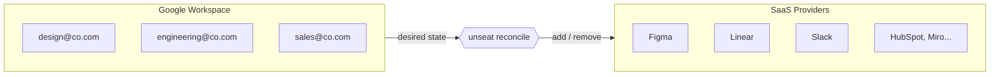
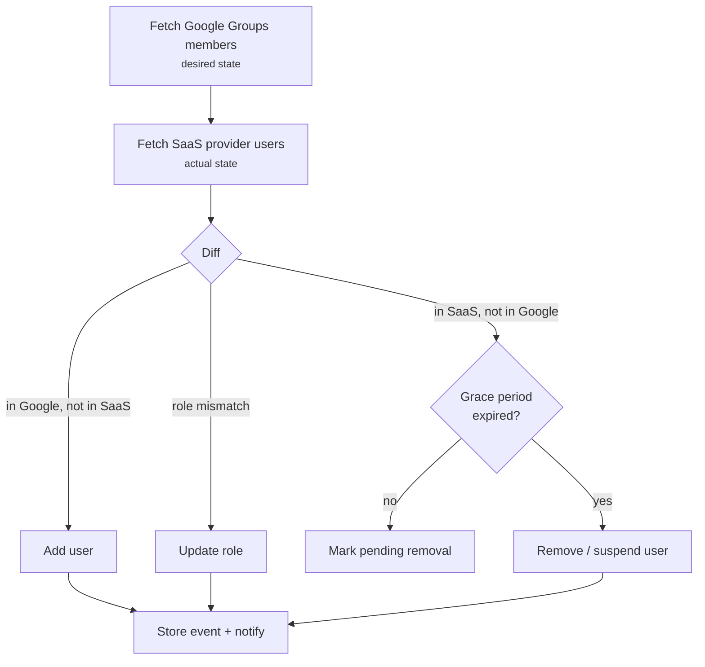
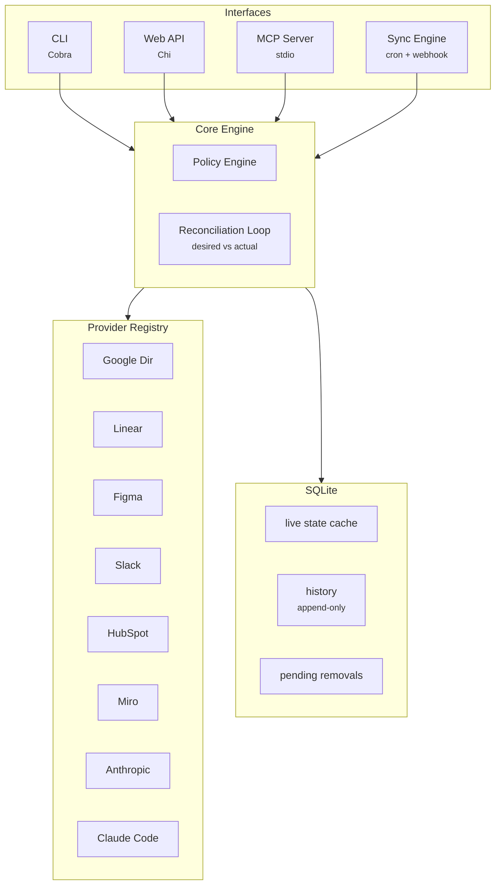

# unseat

Identity Lifecycle Management tool. Cross-references Google Workspace (source of truth) with SaaS providers to automate user provisioning, deprovisioning, and seat optimization.

## Problem

- Paying for SaaS seats of users who left the company
- Orphaned accounts across SaaS products = security surface
- Manual onboarding/offboarding across N tools
- No visibility into who has access to what

## How It Works


```mermaid
flowchart LR
    subgraph GWS["Google Workspace"]
        G1["design@co.com"]
        G2["engineering@co.com"]
        G3["sales@co.com"]
    end

    R{{"unseat reconcile"}}

    subgraph SaaS["SaaS Providers"]
        S1["Figma"]
        S2["Linear"]
        S3["Slack"]
        S4["HubSpot, Miro..."]
    end

    GWS -- desired state --> R
    R -- add / remove --> SaaS
```

Kubernetes-style reconciliation: define which Google Groups map to which SaaS providers, and unseat keeps them in sync. Add someone to a group, they get provisioned. Remove them from Google Workspace, their SaaS seats get cleaned up (with configurable grace period and notifications).

## Providers (55)

| Category | Provider | API | Remove |
|----------|----------|-----|:------:|
| **Identity** | Google Directory | Admin SDK | yes |
| | Okta | REST v1 | yes (deactivate) |
| | Auth0 | Management API v2 | yes |
| | Azure AD / Entra ID | Microsoft Graph | yes |
| | AWS IAM Identity Center | SCIM v2 | yes |
| | GCP IAM | Cloud Identity | yes |
| **Engineering** | GitHub | REST v3 | yes |
| | GitLab | REST v4 | yes (block) |
| | Atlassian (Jira/Confluence) | SCIM v2 | yes |
| | Linear | GraphQL | yes (suspend) |
| | Notion | SCIM v2 | yes |
| | Shortcut | REST v3 | yes |
| **Project Management** | Asana | REST | yes |
| | Monday.com | GraphQL | yes (deactivate) |
| | ClickUp | REST v2 | yes |
| | Trello | REST | yes |
| **Infrastructure** | Vercel | REST v3 | yes |
| | Netlify | REST | yes |
| **Observability** | Datadog | REST v2 | yes |
| | PagerDuty | REST v2 | yes |
| | Grafana | REST | yes |
| | New Relic | REST v2 | yes |
| | Sentry | REST | yes |
| **CRM / Support** | Salesforce | REST / SOQL | yes (deactivate) |
| | HubSpot | Settings v3 | yes |
| | Intercom | REST v2 | yes (set away) |
| | Zendesk | REST v2 | yes |
| | Freshdesk | REST v2 | yes |
| **Communication** | Slack | SCIM v2 | yes (deactivate) |
| | Microsoft Teams | Graph API | yes |
| | Zoom | REST v2 | yes |
| | Discord | REST v10 | yes (kick) |
| | Loom | REST | yes |
| **Storage** | Dropbox | Business API | yes |
| | Box | REST v2 | yes |
| **Security** | 1Password | SCIM v2 | yes (deactivate) |
| | LastPass | Enterprise API | yes |
| | Snyk | REST v1 | yes |
| **Design** | Figma | SCIM v2 | yes (deactivate) |
| | Canva | SCIM v2 | yes |
| | Adobe Creative Cloud | UMAPI | yes |
| **Legal** | DocuSign | Admin API | yes |
| **AI** | Anthropic (Claude) | Admin API | yes |
| | Claude Code | Admin API | yes (filtered) |
| **Finance** | Brex | REST v2 | yes (disable) |
| | Stripe | SCIM v2 | yes |
| **HR** | Rippling | SCIM v2 | yes (deactivate) |
| | BambooHR | REST | yes (terminate) |
| | Deel | REST v2 | yes (terminate) |
| **Data** | Airtable | Enterprise API | yes |
| | Snowflake | SCIM v2 | yes (deactivate) |
| | Databricks | SCIM v2 | yes (deactivate) |
| **Other** | Miro | REST v2 | yes |

Adding a provider = implement the `Provider` interface + register in factory.

## Quick Start

Start read-only. No YAML, no Google Workspace connection, nothing written to any provider.

```bash
make build

# Connect a provider (OAuth2 browser flow, or an API key prompt)
unseat providers add linear slack

# What is wrong with your seats, right now
unseat scan
```

`scan` reports deactivated-but-billed accounts, identities outside your domain,
privileged-account sprawl, and — for providers whose API exposes it — unused
seats. Add `cost_per_seat` to your config and the same report comes back in
euros.

Reconciliation is the second step, once the read-only picture is worth acting on:

```bash
cp unseat.example.yaml unseat.yaml   # map Google Groups to providers

unseat audit seats                   # classify every seat against the directory
unseat sync plan                     # what reconciliation would change
unseat sync apply                    # execute, after showing the plan and confirming
unseat sync watch --interval 5m      # daemon
```

### Credentials

Three sources, in order of precedence:

1. `api_key` written in `unseat.yaml`
2. `${ENV_VAR}` references in that file, expanded from the environment and from `.env`
3. the credential store filled by `unseat providers add`, at `~/.config/unseat/credentials.json`

An undefined `${VAR}` is a hard error — a literal `${LINEAR_API_KEY}` sent as a
bearer token only ever surfaces as an unexplained 401.

## Configuration

```yaml
identity_source:
  provider: google-directory
  domain: mycompany.com
  credentials_file: ./credentials.json

providers:
  linear:
    api_key: "${LINEAR_API_KEY}"
  slack:
    api_key: "${SLACK_SCIM_TOKEN}"
  anthropic:
    api_key: "${ANTHROPIC_ADMIN_KEY}"
  claude-code:
    api_key: "${ANTHROPIC_ADMIN_KEY}"
  figma:
    api_key: "${FIGMA_SCIM_TOKEN}"
    extra:
      tenant_id: "${FIGMA_TENANT_ID}"

mappings:
  - group: engineering@mycompany.com
    providers:
      - name: linear
        role: member
      - name: claude-code
        role: claude_code_user
      - name: slack
        role: member

  - group: design-team@mycompany.com
    providers:
      - name: figma
        role: editor
      - name: miro
        role: member

policies:
  grace_period: 72h          # Wait before removing
  dry_run: false
  notify_on_remove: true
  notify_channels:
    - slack:#it-ops
    - email:admin@mycompany.com
  exceptions:
    - email: cto@mycompany.com
      providers: ["*"]        # Never remove
```

## Reconciliation Flow


```mermaid
flowchart TD
    A["Fetch Google Groups members<br/><small>desired state</small>"] --> B["Fetch SaaS provider users<br/><small>actual state</small>"]
    B --> C{"Diff"}
    C -- "in Google, not in SaaS" --> D["Add user"]
    C -- "in SaaS, not in Google" --> E{"Grace period<br/>expired?"}
    C -- "role mismatch" --> F["Update role"]
    E -- no --> G["Mark pending removal"]
    E -- yes --> H["Remove / suspend user"]
    D & F & H --> I["Store event + notify"]
```

## CLI

```
unseat
├── scan                     Read-only seat audit — no directory, no mappings needed
├── audit
│   ├── seats                Classify every seat: managed / unmapped / orphan / external
│   ├── orphans              Seats with no active directory identity
│   ├── inactive [--days]    Unused seats, on providers that expose activity
│   └── drift                Desired vs actual, without applying anything
├── sync
│   ├── plan                 Show what would change — never mutates
│   ├── apply [--yes]        Execute, after showing the plan and confirming
│   └── watch [--interval]   Daemon mode
├── providers
│   ├── list                 Configured providers, credential and mapping status
│   ├── users <name>         Cached users for a provider
│   ├── test <name...>       Verify connectivity against the real API
│   ├── add <name...>        OAuth2 browser flow or API key
│   └── supported            All known providers
├── history
│   └── events [--limit]     Event timeline
├── serve [--port] [--host]  REST API + dashboard (loopback by default, no auth)
└── mcp                      MCP server (stdio) for LLM agents
```

All commands support `--json`. Global flags: `--config`, `--db`, `--env-file`.

## What Gets Removed, and What Does Not

Group mappings declare who *should* have access. They do not decide removal.
Removal follows the directory, because "absent from a mapped group" and "no
longer employed" are different facts with very different consequences.

| Class | Meaning | Action |
|---|---|---|
| `managed` | active employee, in a mapped group | none |
| `unmapped` | active employee, no mapped group grants this provider | **reported, never removed** — fix the mapping |
| `orphan` | absent from the directory, or suspended in it | reclaimable |
| `external` | identity outside the corporate domain | reported, human decision |
| `unresolved` | provider username with no email and no alias | reported, add an alias |

Only `orphan` is ever removed automatically. An employee your mappings do not
yet cover is never touched, however incomplete the config is — that property is
what makes it safe to turn `dry_run` off.

`sync plan` never mutates anything. `sync apply` shows the plan, asks for
confirmation, and refuses outright while `policies.dry_run` is true.
With a grace period configured, a departed identity's countdown starts at first
detection, is not reset by later syncs, and is cancelled if the identity
becomes active again.

## REST API

```
GET /api/v1/providers              All providers + sync status
GET /api/v1/providers/{name}/users Cached users for a provider
GET /api/v1/orphans                Pending removals
GET /api/v1/history/events         Event timeline
GET /api/v1/mappings               Group-to-provider mappings
```

```bash
unseat serve --port 8080
```

## MCP Server

For LLM agent integration (Claude, etc.) via [Model Context Protocol](https://modelcontextprotocol.io):

```bash
unseat mcp
```

Tools: `list_providers`, `provider_users`, `list_orphans`, `list_events`, `get_mappings`

Guardrails: dry_run by default for destructive actions, audit trail for agent vs human vs cron triggers.

## Architecture


```mermaid
graph TB
    subgraph Interfaces
        CLI["CLI<br/><small>Cobra</small>"]
        API["Web API<br/><small>Chi</small>"]
        MCP["MCP Server<br/><small>stdio</small>"]
        SYNC["Sync Engine<br/><small>cron + webhook</small>"]
    end

    subgraph Core["Core Engine"]
        POLICY["Policy Engine"]
        RECON["Reconciliation Loop<br/><small>desired vs actual</small>"]
    end

    subgraph Providers["Provider Registry"]
        GOOGLE["Google Dir"]
        LINEAR["Linear"]
        FIGMA["Figma"]
        SLACK["Slack"]
        HUBSPOT["HubSpot"]
        MIRO["Miro"]
        ANTHROPIC["Anthropic"]
        CLAUDE["Claude Code"]
    end

    subgraph Storage["SQLite"]
        CACHE["live state cache"]
        HISTORY["history<br/><small>append-only</small>"]
        PENDING["pending removals"]
    end

    CLI & API & MCP & SYNC --> Core
    Core --> Providers
    Core --> Storage
```

## Adding a Provider

1. Create `internal/provider/<name>/<name>.go`
2. Implement the `Provider` interface:

```go
type Provider interface {
    Name() string
    ListUsers(ctx context.Context) ([]core.User, error)
    AddUser(ctx context.Context, email string, role string) error
    RemoveUser(ctx context.Context, email string) error
    SetRole(ctx context.Context, email string, role string) error
    Capabilities() core.Capabilities
}
```

3. Add constructor call in `internal/provider/factory.go`
4. Add auth config in `internal/auth/providers.go`
5. Write tests with `httptest.NewServer` + `WithBaseURL()`

## Development

```bash
make build          # Build binary
make test           # Run tests with race detection
make lint           # golangci-lint
```

162 tests across 19 packages.

## License

MIT
